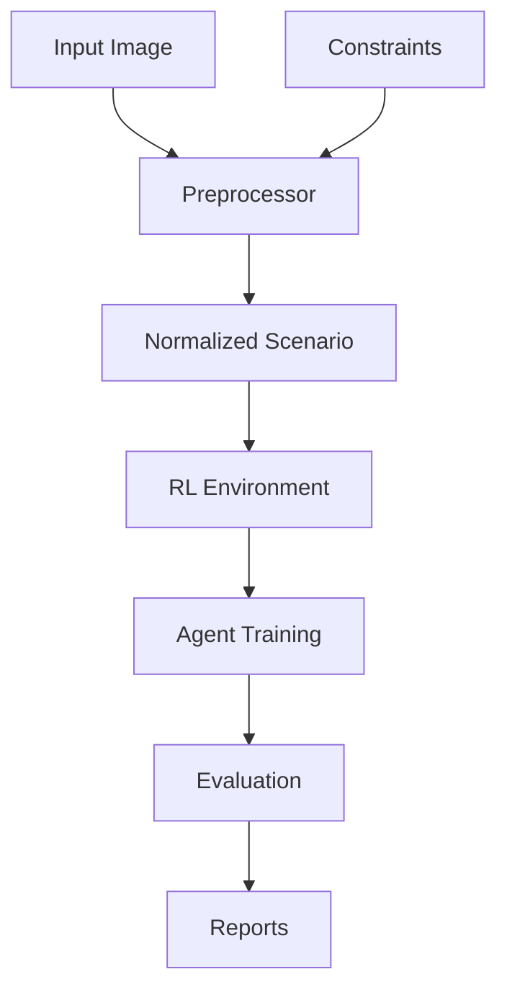

# Generative Design of 2D Mechanical Gear Systems

## Overview
This system uses reinforcement learning to generate valid gear systems that satisfy physical constraints and target torque ratios. The pipeline consists of:

1. **Input Processing**: SVG/PNG images containing boundary polygons and shafts
2. **Constraint Extraction**: JSON files specifying torque ratios and other constraints
3. **Scenario Generation**: Creating training instances with normalized geometries
4. **Reinforcement Learning**: Training an agent to place gears optimally
5. **Evaluation**: Generating reports with system images and gear details

## System Architecture

## Key Components
- **Physics Engine**: Implements gear meshing, collision detection, and torque calculations
- **Constraint System**: Enforces torque ratios, boundary margins, and gear size limits
- **Normalization**: All geometries scaled to fit within 100×100 workspace
- **Reinforcement Learning**: Proximal Policy Optimization (PPO) agent learns optimal gear placement
